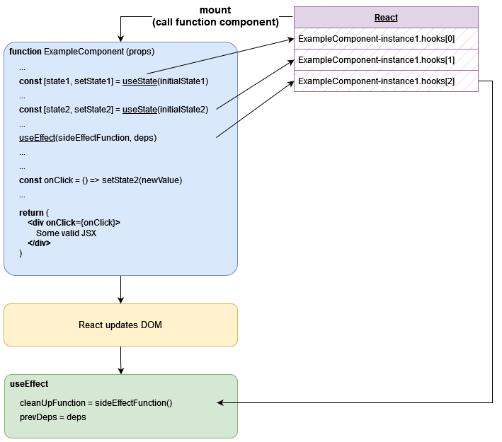
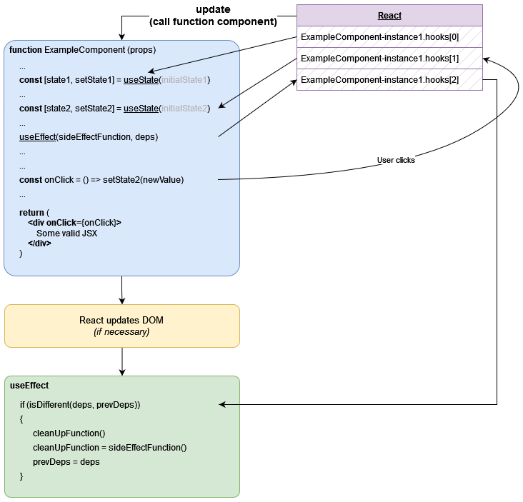
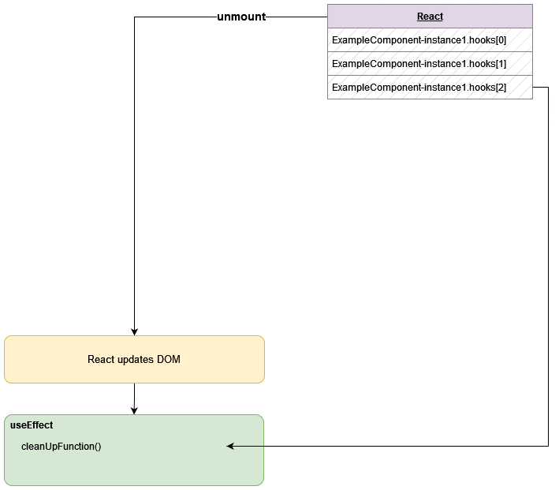

# Side Effects

### useEffect Hook

- Runs after every render by default (initial mount and updates)
- Example use cases

  - Data fetching
  - Setting up a subscription
  - Manually changing the DOM

----

## useEffect Hook

#### Example: event listener

```tsx
import { useEffect, useState } from "react";
import CatSvg from "./CatSvg";

function CursorCat() {
  const [position, setPosition] = useState<{ x: number; y: number }>();

  useEffect(function sideEffect() {
    const eventListener = function (event: MouseEvent) {
      setPosition({
        x: event.clientX + 10,
        y: event.clientY + 10
      });
    };
    document.addEventListener("mousemove", eventListener);
    return function cleanUp() {
      document.removeEventListener("mousemove", eventListener);
    }
  })

  return !position ? null : <CatSvg x={position.x} y={position.y}/>;
}
```

[CodeSandbox example](https://codesandbox.io/s/dreamy-dirac-2ncgyy?file=/src/CursorCat.tsx)

----

## useEffect Hook

#### Example: document modification

```tsx
import { useEffect, useState } from "react";

function HelloWorld() {
  const [count, setCount] = useState(0);

  useEffect(
    function () {
      document.title = `You clicked ${count} times`;
    },
    [count]
  );

  function handleClick() {
    setCount((previous) => previous + 1);
  }

  return (
    <div onClick={handleClick}>
      <h1>Hello World!</h1>
      <p>Click count: {count}</p>
    </div>
  );
}
```

[CodeSandbox example](https://codesandbox.io/s/confident-currying-3vyzp1?file=/src/App.tsx)

----

## useEffect Hook

#### Example: fetch data

```tsx
import { useEffect, useState } from "react";
import { Beer } from "./types";

function TodaysBeer() {
  const [beer, setBeer] = useState<Beer>();

  useEffect(function () {
    async function fetchBeer() {
      const response = await window.fetch(
        "https://random-data-api.com/api/v2/beers"
      );
      const parsedResponse = (await response.json()) as Beer;
      setBeer(parsedResponse);
    }

    fetchBeer();
  }, []);

  return (
    <div>
      <h1>Today's beer </h1>
      {!beer
        ? null
        : Object.entries(beer).map(([key, val]) => (
          <div>
            <b>{key}: </b>
            <span>{val}</span>
          </div>
        ))}
    </div>
  );
}
```

[CodeSandbox example](https://codesandbox.io/s/broken-star-qyoqfs?file=/src/App.tsx)

----

## Component Lifecycle

- **Mount**
  - new component should be rendered
  - first call to function component
- **Update**
  - when props or local state changes
  - subsequent call to function component
- **Unmount**
  - component should be removed

----

## Component Lifecycle - Mount

<figure>
  
</figure>

[CodeSandbox example](https://codesandbox.io/s/quizzical-tree-ueyvzm?file=/src/DemoComponent.tsx)

----

## Component Lifecycle - Update

<figure>
  
</figure>

[CodeSandbox example](https://codesandbox.io/s/quizzical-tree-ueyvzm?file=/src/DemoComponent.tsx)

----

## Component Lifecycle - Unmount

<figure>
  
</figure>

[CodeSandbox example](https://codesandbox.io/s/quizzical-tree-ueyvzm?file=/src/DemoComponent.tsx)

----

## Rules of Hooks

- Hooks are JavaScript functions coupled to the lifecycle of a React component
- Their implementation imposes two important rules:
  - **Calls to Hooks are only allowed inside**
    - Function components
    - other (custom) hooks (named `use...`)
  - **All Hooks must be called on every render, and always in the same order**
    - Do not call hooks conditionally (if, early returns, loops, ...)
- These rules can be enforced via automatic code checks (linting)

----

## Supplementary

### Custom Hooks

- Existing hooks (basic or other custom ones) can be used to compose a custom hook.
- Custom Hooks may have input parameters and any return value
- Allow us to reuse logic and keep components simple and clean
- Plethora of custom hooks are already out there waiting to be _use_-d

  - Example: https://github.com/streamich/react-use
